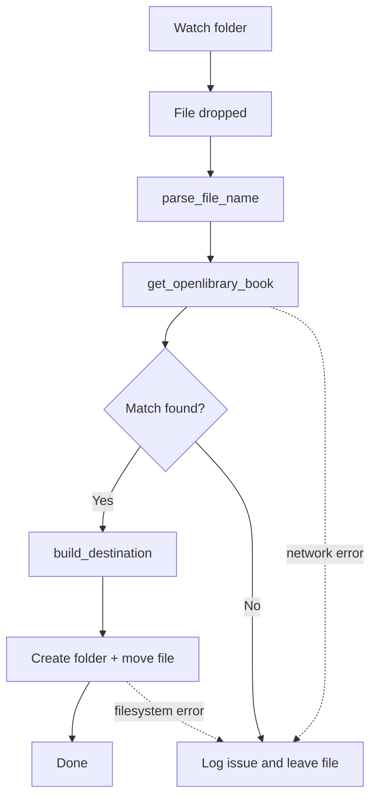

# elibrarian

Small helper to organise ebooks dropped into a watched folder. It parses filenames, queries Open Library for metadata, builds a destination folder (Author / Title) and moves the file into an ebook folder.

---

**Status**: prototype — basic parsing and Open Library lookup implemented. Error handling and logging have been added so files stay in the source folder on failure.

**Requirements**
- Python 3.10+
- See `pyproject.toml` for project metadata. At minimum install:

```bash
pip install httpx pydantic
```

**Quick usage**

A small example to try a single file move from Python REPL or a script:

```bash
python -c "from pathlib import Path; from elibrarian.src.main import restructure_file; print(restructure_file(Path('/path/to/library'), Path('/tmp/example.epub')))"
```

Replace `/path/to/library` and `/tmp/example.epub` with your paths.

**Example flow**



**Files of interest**

- `elibrarian/src/main.py` — core `restructure_file()` function that orchestrates parsing, lookup and moving.
- `elibrarian/src/openlibrary.py` — Open Library querying and parsing.
- `elibrarian/src/parser.py` — filename parsing to extract title/author/year/isbn.
- `elibrarian/src/pathing.py` — destination folder building and name sanitisation.

**Behavior & errors**
- The code logs failures and returns `None` on failure; files are left where they are to allow retry or manual handling.
- Network/HTTP errors from Open Library are caught and logged.
- Moves use `shutil.move` to support cross-filesystem moves.

**Next steps**
- Add a watcher (inotify) CLI to watch a folder and call `restructure_file()` on new files.
- Add unit tests and a CI workflow.
- Add configuration for logging level and destination base path.

---
